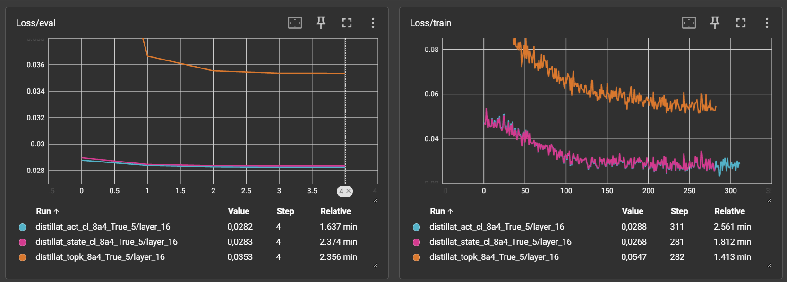
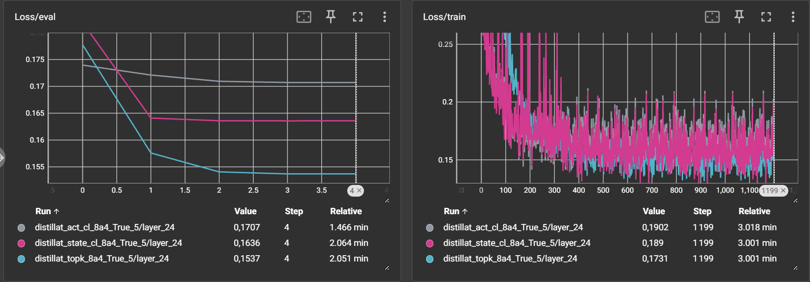
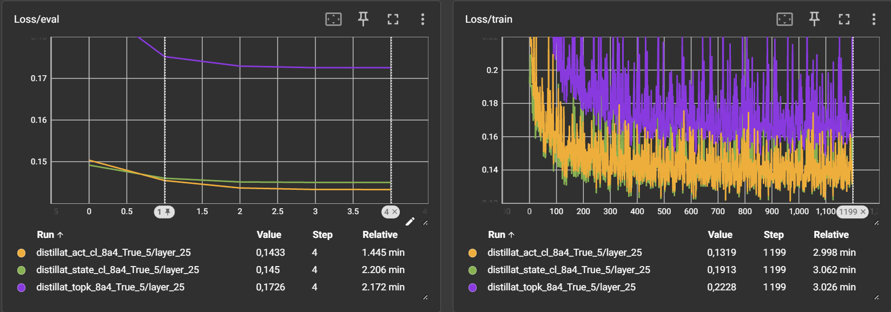
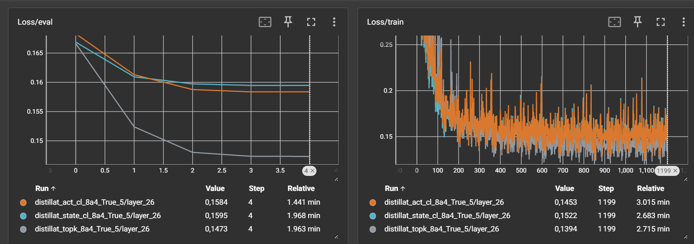

# moe-pruner: DeepSeek-v3 Pruning for the GPU Poor

This repository provides a methodology for pruning DeepSeek-v3, a Mixture-of-Experts (MoE) model, to make it more accessible for users with limited GPU resources ("the GPU poor").  This is achieved by significantly reducing the number of experts in the MoE layers.

**Warning:** This is a highly experimental technique.  Results are not guaranteed, and significant improvements are planned for future versions.  Use at your own risk.

## CONTRIBUTE
Due to hardware limitation, i was forced to make a lot of trade off. If you'd like to participate in upcoming versions with a higher compute budget, you can donate here: https://gofund.me/1516dccd

You can also propose improvement on the git repo.

## Project Goal

The primary goal is to drastically reduce the computational and memory requirements of DeepSeek-v3 while retaining a reasonable level of performance.  This is accomplished through a multi-stage distillation and pruning process.

## Methodology and abloation study.

### Core methodology:
- 1. Create a small but high quality calibration dataset
- 2. Use the dataset to prune experts, with several variant (see ablation below)
- 3. Consolidate the model with pruned experts
- 4. Post train on an instruct dataset to recover

### Ablation
Figures of the ablation for deepseek-ai/DeepSeek-Coder-V2-Lite-Instruct can be found in the img folder.

#### Method 1 : act_cl
This method uses gate information to cluster the experts based on their co activation (i.e affinity is the number of time two experts are activated together).
The clustering algorithm is a simple spectral clustering based on the resulting affinity matrix.

The experts of a given cluster are then merged using the SCE method from mergekit.

#### Method 2 : state_cl
This method is similar to act_cl but uses a different approach to build the similarity matrix, instead of monitoring the experts activation, it computes the mean pairwise cosine similarity of two given experts outputs.

#### Method 3 : tok_k
This method is more basic and just keeps the experts that have the highest activation count on the calibration dataset.

#### Variant 1 : False_1
This variant means that there was no calibration on the newly created experts after merging, so postraining is using the raw weights from the pruning

#### Variant 2 : True_1
This variant means that the pruned experts are calibrated for one epoch after pruning, hence some recovery is expected. Calibration is done with original weights still in AWQ format, and new experts weights in frozen bfloat16 with a Dora layer on top.

#### Variant 3 : True_5
This variant means that the pruned experts are calibrated for five epoch after pruning, hence lot recovery is expected, but might lead to overfitting which might affect the post training negatively. Calibration is done with original weights still in AWQ format, and new experts weights in frozen bfloat16 with a Dora layer on top.

### Results of the different methods
#### Comparison of clustering methods (act_cl vs state_cl vs tok_k) on layer 16 True_5

#### Comparison of clustering methods (act_cl vs state_cl vs tok_k) on layer 24 True_5 (with top_k beating the other methods)

#### Comparison of clustering methods (act_cl vs state_cl vs tok_k) on layer 24 True_5

#### Comparison of clustering methods (act_cl vs state_cl vs tok_k) on layer 24 True_5 (with top_k beating the other methods)

#### Comparison of postraining

### Analysis and hypothesis
Observations on layer wise distillation:
- On higher layers, regarding distillation loss, act_cl and state_cl outperform substantially top_k, with act_cl slightly above act_cl
- On some specific layers, especially deeper layers, top_k outperform the two other by a wide margin, maybe hinting at a higher information density, or a possibility to improve the fusion (i'll perform a new test with both higher and lower information retention treshold in sce to wee how it fares.)
- Whether or not the topk will  beat the other seems to depend on random_seed, with variable results.
- As we go deeper in the network, the distillation loss seems to converge toward a higher value.

Observations on post training:
- The True 5 variants, despite reaching a better loss than True 1, seems to mostly output correct grammar, but non sensical content.
- The True 1 variants are much better in this regard, and seems to even exibit some reasoning capabilities,despite their small size (1b) and compression factor (1/16) wich is kinda impressive

## Contributions
Due to hardware limitation, this repo required a few hacks to work properly. You'll find ressources for:
- AWQ single layer loading, load a single layer in the gpu memory to avoid OOM
- AWQ dequant and AWQ Dora merge, enabling lower memory usage thanks to 4bit quantization
- Utilities to manage torch vram and load targeted modules inside a model (for some reasons accelerate implementation of the same stuff was not working)
- Dora layer implementation, with adaptations for bnb and hqq (inspired by the Answer.ai repo fsdp qlora)
- Utilities to analyse experts activations and experts similarity, implemented with numba for blazing fast execution
- A legacy fp8_linear layer, which is a pure pytorch implementation of the Deepseek fp8 kernel, compatible with Ampere gpu inference (not sure about training).

## Disclaimer

This project is experimental and under active development.  The provided code and methodology are subject to change.  There is no guarantee of performance or stability.  Use at your own discretion.

## Contributing

Contributions are welcome!  If you have suggestions for improvements, bug fixes, or new features, please open an issue or submit a pull request.